<div align="center">

```
███╗   ██╗███████╗██╗  ██╗██╗   ██╗███████╗    ███████╗ ██████╗██╗  ██╗ ██████╗ ██╗      █████╗ ██████╗
████╗  ██║██╔════╝╚██╗██╔╝██║   ██║██╔════╝    ██╔════╝██╔════╝██║  ██║██╔═══██╗██║     ██╔══██╗██╔══██╗
██╔██╗ ██║█████╗   ╚███╔╝ ██║   ██║███████╗    ███████╗██║     ███████║██║   ██║██║     ███████║██████╔╝
██║╚██╗██║██╔══╝   ██╔██╗ ██║   ██║╚════██║    ╚════██║██║     ██╔══██║██║   ██║██║     ██╔══██║██╔══██╗
██║ ╚████║███████╗██╔╝ ██╗╚██████╔╝███████║    ███████║╚██████╗██║  ██║╚██████╔╝███████╗██║  ██║██║  ██║
╚═╝  ╚═══╝╚══════╝╚═╝  ╚═╝ ╚═════╝ ╚══════╝    ╚══════╝ ╚═════╝╚═╝  ╚═╝ ╚═════╝ ╚══════╝╚═╝  ╚═╝╚═╝  ╚═╝
```

### *Enterprise AI Research Intelligence Platform*

---

[](https://python.org)
[](https://fastapi.tiangolo.com)
[](https://groq.com)
[](LICENSE)

---

> **NexusScholar** is a production-grade Retrieval-Augmented Generation (RAG) system purpose-built for  
> scientific literature analysis. It retrieves, synthesizes, and cites research papers with enterprise-level  
> accuracy, anti-hallucination guarantees, math verification, and streaming SSE delivery — all grounded  
> exclusively in indexed evidence.

---

</div>

## Table of Contents

- [System Overview](#-system-overview)
- [Architecture at a Glance](#-architecture-at-a-glance)
- [The Full Query Pipeline](#-the-full-query-pipeline)
- [Ingestion Pipeline](#-ingestion-pipeline)
- [Indexing Layer](#-indexing-layer)
- [Retrieval System](#-retrieval-system)
- [Entity Grounding & Anti-Hallucination](#-entity-grounding--anti-hallucination-system)
- [Generation Pipeline](#-generation-pipeline)
- [Math Verification System](#-math-verification-system)
- [Verification & Quality System](#-verification--quality-system)
- [Coverage Verification & Gap Fill](#-coverage-verification--gap-fill)
- [External Integrations](#-external-integrations)
- [Streaming SSE Contract](#-streaming-sse-contract)
- [Configuration Reference](#-configuration-reference)
- [API Reference](#-api-reference)
- [Quick Start](#-quick-start)
- [Performance Characteristics](#-performance-characteristics)
- [Directory Structure](#-directory-structure)

---

## System Overview

NexusScholar is not a chatbot. It is a **research synthesis engine** — a system that thinks the way a PhD student does when conducting a literature review, but executes in seconds instead of weeks.

When a researcher asks *"Compare BERT, RoBERTa, and DeBERTa on GLUE and SuperGLUE"*, NexusScholar does not generate an answer from training memory. It:

1. **Decomposes compound questions** — detects if the query has multiple embedded sub-questions and splits them for maximum coverage
2. **Classifies intent** — understands this is a `benchmark_comparison` requiring tables and recent papers
3. **Rewrites the query** — into 5 parallel retrieval forms optimized for BM25, dense embeddings, HyDE, and arXiv
4. **Fetches live papers** — from Exa, Tavily, and Semantic Scholar, hydrates the corpus in real-time
5. **Retrieves at 5 granularities** — document, section, passage, claim, and table chunks
6. **Fuses with RRF** — across BM25, dense, HyDE, ColBERT lanes with intent-tuned weights
7. **Reranks twice** — pointwise cross-encoder, then listwise LLM reranking
8. **Extracts and executes math** — runs LLM-generated Python code in an isolated sandbox, verifies results against web sources
9. **Synthesizes with 10 hard rules** — citation tags, entity locks, peer-review labels, Python sandbox mandate, abstention logic
10. **Verifies the answer** — NLI entailment checks, entity consistency scan, self-evaluation, per-sub-question coverage audit with targeted gap-fill

Every factual sentence is traceable to a specific chunk of a specific paper. Every calculation is executed in an isolated subprocess.

---

## Architecture at a Glance

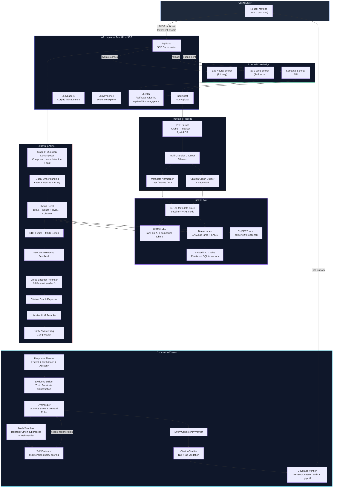

---

## The Full Query Pipeline

The following is the exact execution order of every stage for a single query request.

```mermaid
flowchart TD
    START(["POST /api/chat\n{query, corpus_id, recency_filter}"])

    subgraph STAGE_0["STAGE 0 · Compound Question Decomposition"]
        Z1["decompose_question\nLLM detects if query contains\nmultiple distinct sub-questions"]
        Z2{{"is_compound?"}}
        Z3["Split into 2–5 atomic sub-questions\nEach is self-contained and answerable\nEmit: question_decomposition SSE"]
        Z4["Single-question path — no-op\nOriginal query passed through"]
        Z5["Merge sub-question query rewrites\nUnion all BM25/dense/arxiv forms\nCasts the widest retrieval net"]
    end

    subgraph STAGE_A["STAGE A · Query Understanding"]
        A1["Intent Classification\nGroq fast-model · 10 intent types"]
        A2["Query Rewriting\n5 parallel forms:\ndense · BM25 · HyDE · acronym · arxiv"]
        A3["Entity Extraction\nQueryEntityProfile:\nprimary_subject · exclusion_entities\nspecificity_score"]
        A4{{"specificity_score >= 0.6?"}}
        A5["requires_entity_grounding = TRUE\nActivates entity reranking penalty\nentity-aware compression\nentity lock in synthesizer"]
        A6["requires_entity_grounding = FALSE\nStandard pipeline path"]
        A7["Year Constraint Resolution\nImplicit recency detection:\nlatest / recent / state of the art"]
        A8["Auto-Recency Tightening\nbenchmark_comparison + trend_analysis\n+ recency_filter='any' + non-historical\n→ auto-apply 2y constraint"]
    end

    subgraph STAGE_EXT["STAGE EXT · External Retrieval"]
        EXT1["Exa Neural Search (Primary)\narXiv queries · year filter\nhighlights · autoprompt\n40 results · 40,000 chars max"]
        EXT2{{"≥ 2 Exa results?"}}
        EXT3["Tavily Fallback\nadvanced depth · academic domains\nOnly when Exa < 2 results"]
        EXT4["Semantic Scholar\nConcurrent arXiv/DOI lookup\ncitation counts · venue · peer-review"]
        EXT5["Hydrate Corpus\nPDF download → parse → chunk\n→ index → SSE: sources_ingested"]
    end

    subgraph STAGE_B["STAGE B · Hybrid Recall"]
        B1["BM25 Recall\nrank-bm25 · compound token protection\nstopword removal · Snowball stemming\nTop-500 per query"]
        B2["Dense Recall\nBAAI/bge-large-en-v1.5 · FAISS\nquery prefix injection\nTop-500 per query"]
        B3["HyDE Lane\nHypothetical Document Embeddings\nGroq generates fake answer → embed → search"]
        B4["ColBERT Lane\nLate-interaction token matching\noptional · disabled by default"]
        B5["RRF Fusion\nRRF(d) = sum 1/(k+rank)\nk=60 · top_FUSED=300"]
        B6["MMR Deduplication\nlambda=0.7 (0.85 for entity-grounded)\nBalance relevance vs diversity"]
        B7["External Paper Prioritization\nExa/Tavily papers boost x1.5 RRF\nKeep up to 50% local corpus candidates"]
    end

    subgraph STAGE_C["STAGE C · Re-ranking"]
        C1["Metadata Resolution\nBatch fetch paper titles · years · venues\nfrom SQLite for all fused candidates"]
        C2["Year Filtering\nApply year_min / year_max constraints\n+ auto-recency cutoff from intent"]
        C3["Paper-First Filtering\nBoost chunks from explicitly named papers\nTitle match → boost rrf_score x 1.5"]
        C4["Parent-Child Expansion\nFor passage chunks: fetch parent section\nInject parent_context into metadata"]
        C5["Sibling Passage Expansion\nFetch adjacent passages by char offset\nwindow=1 for top candidates"]
        C6["Cross-Encoder Reranker\nBAAI/bge-reranker-v2-m3\nMulti-signal score:\nrelevance · recency · citation_count\nPageRank · section_weight · entity_boost/penalty\nTop-100 kept"]
        C7["Pseudo-Relevance Feedback\nExtract expansion terms from top-5\nBM25 re-query → inject up to 10 new candidates\n0.5x score discount for new PRF candidates"]
        C8["Citation Graph Expansion\ncited-by · references · co-citation clusters\nshared-dataset · same-venue+topic"]
        C9["Final Cross-Encoder Rerank\nTop-25 final evidence set\nYear filter · 3 chunks/paper limit"]
        C10["Listwise LLM Reranking\nGroq: rank top-12 holistically\nPaper metadata context injected"]
    end

    subgraph STAGE_D["STAGE D · Postprocessing"]
        D1["Entity-Aware Groq Compression\nReturns: WRONG_ENTITY · AMBIGUOUS\nIRRELEVANT · or extracted sentences\nApplied to ALL candidates"]
        D2["Corpus Coverage Check\nCount entity-consistent candidates\n< MIN_ENTITY_CONSISTENT (2) → abstain"]
    end

    subgraph STAGE_E["STAGE E · Evidence Construction"]
        E1["Response Planner\nformat · confidence_score · should_abstain?\nMulti-signal: score + count + diversity\n+ peer-review status"]
        E2["Evidence Table Builder\nEvidenceRow × N:\nevidence_id · paper_title · year · venue\nchunk_text · relevance_score · source_url\nis_peer_reviewed · is_preprint · is_retracted\nparent_context · pdf_url"]
        E3["Evidence Deduplication\nRemove near-duplicate rows"]
    end

    subgraph STAGE_F["STAGE F · Synthesis"]
        F1["LLaMA3.3-70B via Groq\nSYSTEM: 10 Hard Citation Rules\nDepth/quality requirements\nLaTeX math notation rules\nAdversarial chain-of-arithmetic\nPython sandbox mandate (RULE 10)"]
        F2["Token Budget Manager\nTrim evidence to fit 11,800 token limit"]
        F3["Entity Grounding Section\nInject exclusion entities + primary subject\nbefore evidence table for entity-locked queries"]
        F4["Streaming SSE\nToken-by-token via synthesis_token events\nMarkdown table formatter post-process"]
        F5["Math Sandbox Execution\nExtract ```python blocks\nRun in isolated subprocess\nDouble-verify results\nWeb-search grounded LLM audit\nEmit: math_results SSE"]
    end

    subgraph STAGE_G["STAGE G · Verification and Quality"]
        G1["Self-Evaluator\n8 dimensions: completeness · citation_density\nspecificity · coherence · table_quality\nentity_consistency · parametric_contamination · overall\nComposite threshold → needs_regeneration?"]
        G2{{"needs_regeneration\nAND attempts < 2?"}}
        G3["Regeneration\nPatch TaskPlan with issue hints\nRe-synthesize with targeted instructions"]
        G4["Entity Consistency Verifier\nPost-synthesis: did LLM use correct entity?\nConfidence > 0.70 → prepend warning banner"]
        G5["Citation Verifier\nExtract all CIT:id tags\nValidate vs evidence_id set\nNLI entailment score per claim\nFlag: hallucinated · retracted · preprint"]
        G6["Coverage Verifier\nPer-sub-question: FULLY / PARTIAL / MISSING\nMISSING → targeted Tavily re-search\n+ mini-synthesis per gap\nEmit: coverage_gaps SSE"]
        G7["Citation Renderer\nReplace CIT:id with numbered refs\nBuild citation cards with full metadata"]
        G8["Save to DB\nevidence_table · answer · conversation\nmessages · citations"]
        G9(["answer_complete SSE\nmarkdown_text · citations · quality_meta\ncitation_cards · uncertainty_flags"])
    end

    START --> Z1
    Z1 --> Z2
    Z2 -->|"Yes"| Z3 --> Z5
    Z2 -->|"No"| Z4 --> A1
    Z5 --> A1
    A1 --> A2 --> A3
    A3 --> A4
    A4 -->|"Yes"| A5
    A4 -->|"No"| A6
    A5 & A6 --> A7 --> A8
    A8 --> EXT1
    EXT1 --> EXT2
    EXT2 -->|"No"| EXT3 --> EXT4
    EXT2 -->|"Yes"| EXT4
    EXT4 --> EXT5
    EXT5 --> B1 & B2 & B3
    A8 --> B1 & B2
    B3 & B4 & B1 & B2 --> B5
    B5 --> B6 --> B7
    B7 --> C1 --> C2 --> C3 --> C4 --> C5
    C5 --> C6
    C6 --> C7 --> C8 --> C9 --> C10
    C10 --> D1 --> D2
    D2 -->|"coverage OK"| E1
    D2 -->|"gap detected"| G9
    E1 --> E2 --> E3
    E3 --> F1 & F2 & F3
    F2 --> F4
    F4 --> F5
    F5 --> G1
    G1 --> G2
    G2 -->|"Yes"| G3 --> F4
    G2 -->|"No"| G4
    G4 --> G5 --> G6 --> G7 --> G8 --> G9

    style STAGE_0 fill:#0f172a,stroke:#a78bfa,color:#ede9fe
    style STAGE_A fill:#0f172a,stroke:#6366f1,color:#c7d2fe
    style STAGE_EXT fill:#0f172a,stroke:#10b981,color:#d1fae5
    style STAGE_B fill:#0f172a,stroke:#f59e0b,color:#fef3c7
    style STAGE_C fill:#0f172a,stroke:#ef4444,color:#fee2e2
    style STAGE_D fill:#0f172a,stroke:#8b5cf6,color:#ede9fe
    style STAGE_E fill:#0f172a,stroke:#06b6d4,color:#cffafe
    style STAGE_F fill:#0f172a,stroke:#ec4899,color:#fce7f3
    style STAGE_G fill:#0f172a,stroke:#22c55e,color:#dcfce7
```

---

## Ingestion Pipeline

Every document entering NexusScholar goes through a deterministic transformation pipeline that produces **5 parallel representations** of every paper — each optimized for a different retrieval scenario.

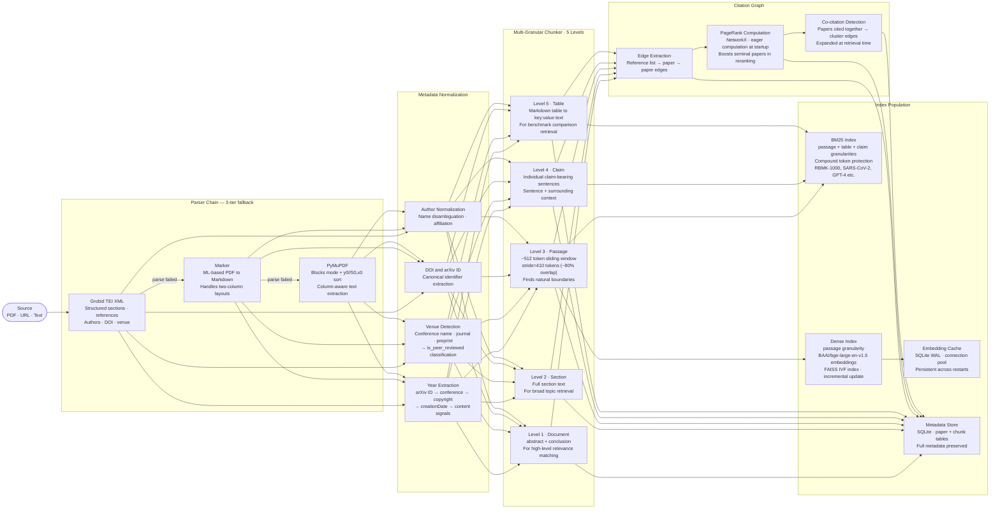

### Chunk Granularity Decision Matrix

| Level | Granularity | Size | Best For | Index |
|-------|-------------|------|----------|-------|
| 1 | Document | Full abstract + conclusion | High-level topic matching, `paper_lookup` intent | Dense |
| 2 | Section | Full section (~1000–3000 tokens) | Broad survey retrieval, context expansion | BM25 |
| 3 | Passage | ~512 tokens, ~80% overlap (stride=410) | Standard retrieval — the primary retrieval unit | BM25 + Dense |
| 4 | Claim | 1–3 sentences | Fact verification, specific claim retrieval | BM25 |
| 5 | Table | Serialized table rows | Benchmark comparison, `benchmark_comparison` intent | BM25 |

---

## Indexing Layer

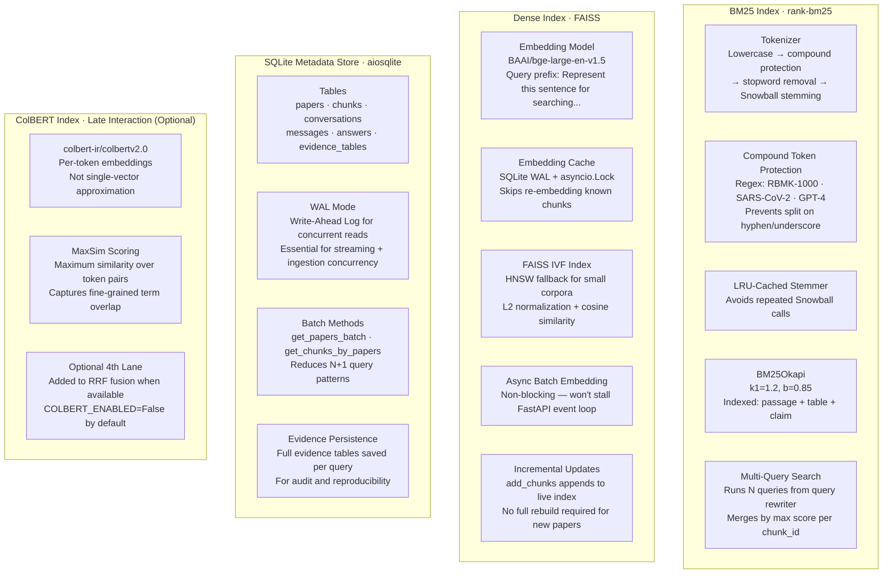

---

## Retrieval System

The retrieval system runs **four parallel lanes**, fuses them with Reciprocal Rank Fusion, and applies multiple refinement passes.

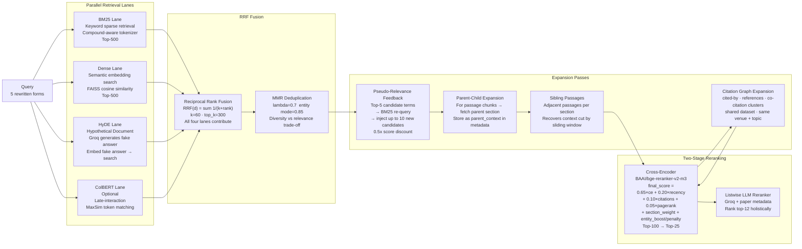

### Intent → Retrieval Routing Table

| Intent | Auto Recency | Section Priority | Tables | Notes |
|--------|-------------|------------------|--------|-------|
| `benchmark_comparison` | 2y (auto) | results, experiments, evaluation | boosted | Sub-question decomposition active |
| `literature_survey` | none | abstract, intro, related_work | no | Wide retrieval net |
| `paper_lookup` | none | abstract | no | BM25-heavy, paper-first filter |
| `method_explanation` | none | method, architecture, approach | no | Dense-heavy |
| `trend_analysis` | 2y (auto) | abstract, intro, conclusion | no | Time-ordered synthesis |
| `dataset_discovery` | none | dataset, experiments | boosted | BM25-heavy |
| `definition` | none | abstract, intro, related_work | no | Dense-heavy |
| `contradiction_check` | none | results, discussion, limitations | no | Comparison-oriented |
| `author_search` | none | — | no | Paper-first filter active |
| `general` | none | — | no | Balanced weights |

### Multi-Signal Reranker Score Formula

```
final_score(d) =
    0.65 × cross_encoder_score(query, chunk)
  + 0.20 × recency_score(paper.year)           // log decay from current year
  + 0.10 × citation_score(paper.citation_count) // log-normalized
  + 0.05 × pagerank_score(paper.paper_id)       // NetworkX PageRank
  + section_weight(chunk.section_tag)            // abstract=+0.1, methods=+0.05
  + entity_boost(entity_profile, chunk)          // +0.12 match / -0.20 wrong entity
```

---

## Entity Grounding & Anti-Hallucination System

This is NexusScholar's most critical safety system. It prevents **entity substitution hallucinations** — the failure mode where an LLM answers about TRIGA reactors when asked about RBMK reactors, or answers about RoBERTa when asked specifically about BERT.


---

## Generation Pipeline

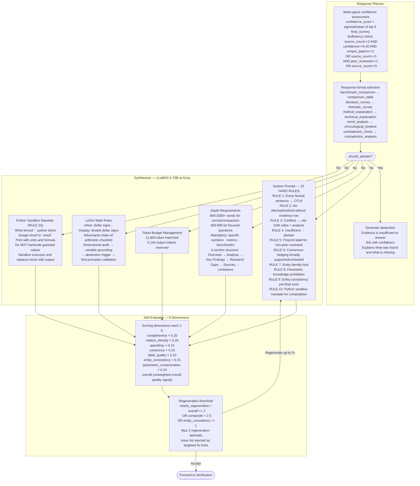

---

## Math Verification System

NexusScholar enforces **RULE 10 — Python Sandbox Mandate**: when the synthesizer needs to compute a numerical result, it writes a fenced Python code block. The pipeline then executes this code in a sandboxed subprocess and verifies the result via web search.

```mermaid
flowchart TD
    subgraph SANDBOX["Math Sandbox — math_sandbox.py"]
        SB1["LLM emits fenced ```python block\nMust assign result to `result`\nMust print with units"]
        SB2["Variable Extraction from Evidence\nRegex patterns extract numeric labels\nEvidence values OVERRIDE any LLM values\nPrevents hardcoded hallucination"]
        SB3["Subprocess Execution\nWrites to tempfile · runs python subprocess\nTimeout: 8 seconds\nNo exec() or eval() — child process only\nnumpy · sympy · fractions · math · decimal\nstatistics available inside sandbox"]
        SB4["Double Verification\nExecute twice independently\nDivergent results → FAILED\nConsistent results → pass forward"]
        SB5["Terminal Banner\nFull execution log printed to console\nEvery math block always visible for audit"]
        SB6["Replace code block in text\nWith formatted execution output\nEmit: math_results SSE with updated_text"]
    end

    subgraph WEB_VERIFY["Math Web Verifier — math_web_verifier.py"]
        WV1["Build targeted search query\nFrom code + result + user query context\nOnly for non-trivial numeric results"]
        WV2["Fetch web snippets via Tavily\n(general web, not scholarly-only)\nTop-N authoritative snippets"]
        WV3["LLM Audit — two axes:\n1. FORMULA AXIS: Is the method correct?\n2. PLAUSIBILITY AXIS: Is the result in range?"]
        WV4["Verdict: verified · plausible · flagged · incorrect · skipped\nshould_display: final gate — show in answer?\nAll failures fall through as 'skipped'\nNever blocks the answer on latency"]
        WV5["Annotate or suppress block\nFlagged/incorrect → suppression_reason prepended\nVerified/plausible → displayed as-is"]
    end

    SB1 --> SB2 --> SB3 --> SB4
    SB4 -->|"consistent"| SB5 --> SB6
    SB4 -->|"divergent"| SB6
    SB6 --> WV1 --> WV2 --> WV3 --> WV4 --> WV5
```

---

## Verification & Quality System

```mermaid
flowchart LR
    RAW["Raw synthesized\nMarkdown text\nwith CIT:id tags"]

    subgraph CITATION_VERIFY["Citation Verification"]
        CV1["Extract all CIT:id patterns\nvia regex"]
        CV2["Validate each evidence_id\nexists in evidence table\nHallucinated? → flag warning"]
        CV3["NLI Entailment Check\ncross-encoder/nli-deberta-v3-base\nThreshold: 0.55\nLow score → claim not fully supported"]
        CV4["Retraction Check\nis_retracted=True → add RETRACTED warning"]
        CV5["Preprint Label\nis_preprint=True → [Preprint] label\nis_peer_reviewed=False → note in Sources"]
        CV6["Replace CIT:id with N\nBuild citation number map"]
    end

    subgraph RENDER["Citation Renderer"]
        CR1["Citation Cards\nFor each numbered reference:\n  title · authors · year · venue\n  source_url · pdf_url · is_peer_reviewed"]
        CR2["Source URL Builder\narXiv → arxiv.org/abs/id\nOpenReview → openreview.net/forum\nACL → aclanthology.org/id\nDOI → doi.org/doi"]
    end

    subgraph MISSING_SECTIONS["Required Section Validator"]
        MS1["Check for mandatory sections:\nSources · Limitations and Confidence\nResearch Gaps for survey/comparison"]
        MS2["Missing? → Groq generates and appends\nStreams appended section as synthesis_token\nEmits quality_warning SSE"]
    end

    subgraph FINAL_SAVE["Persistence"]
        FS1["SQLite:\n  save_evidence_table\n  save_answer\n  insert_message role=assistant\nFull audit trail preserved"]
    end

    RAW --> CV1 --> CV2 --> CV3 --> CV4 --> CV5 --> CV6
    CV6 --> CR1 --> CR2
    CV6 --> MS1
    MS1 -->|"missing"| MS2
    CR2 --> FS1
    MS2 --> FS1
    FS1 --> DONE(["answer_complete SSE\nmarkdown_text\ncitation_cards\nuncertainty_flags\nquality_meta"])
```

---

## Coverage Verification & Gap Fill

For compound queries (multiple sub-questions), NexusScholar audits whether each sub-question is genuinely answered and performs targeted gap-fill for missing coverage.

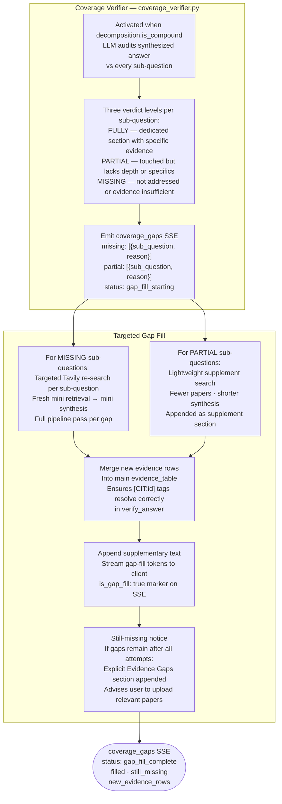

---

## External Integrations

```mermaid
flowchart TD
    subgraph EXA_DETAIL["Exa Neural Search — Primary"]
        EX1["Search type: auto — neural + keyword hybrid\nAutoprompt enabled: AI-enhanced query\nHighlights: 5 sentences x 3 per URL\nLivecrawl timeout: 8,000ms\nMax characters: 40,000 per result\n40 results per query"]
        EX2["Year filtering pushed to Exa API\nDomain: academic sources prioritized"]
        EX3["Paper extraction:\nTitle · URL · year · author · abstract\nHighlight passages → chunks → BM25/dense"]
        EX4["Fallback gate:\n≥ 2 Exa results → skip Tavily\n< 2 results → activate Tavily fallback"]
    end

    subgraph TAVILY_DETAIL["Tavily Web Search — Fallback"]
        T1["search_depth: advanced\nmax_results: 8\ntopic: general (or news for trend_analysis)\nHTTP timeout: 60s"]
        T2["Domain filter: arxiv.org · openreview.net\naclanthology.org · proceedings.mlr.press\nnature.com · pubmed.ncbi.nlm.nih.gov\nbiorxiv.org · semanticscholar.org"]
        T3["Strict fallback:\nOnly activated when Exa returns < 2 results\nNot a parallel search — sequential fallback only\nAlso used for math web verification"]
    end

    subgraph S2_DETAIL["Semantic Scholar — Supplement"]
        S1["Concurrent arXiv queries\nDOI lookup · title search\nField of study classification"]
        S2["Rich metadata:\ncitation_count · influential_citation_count\nfields_of_study · is_open_access\nvenue · journal · conference"]
        S3["Peer review inference:\nVenue name → is_peer_reviewed classification\narXiv-only → is_preprint=True"]
        S4["Runs concurrently with Exa+Tavily\nAdds papers to corpus regardless of Exa results\nS2_AUTO_FETCH=True by default"]
    end

    EX1 --> EX2 --> EX3 --> EX4
    T1 --> T2 --> T3
    S1 --> S2 --> S3 --> S4
```

---

## Streaming SSE Contract

NexusScholar communicates with the frontend via **Server-Sent Events**. Every event type is guaranteed — the frontend must not depend on event ordering beyond the defined sequence.

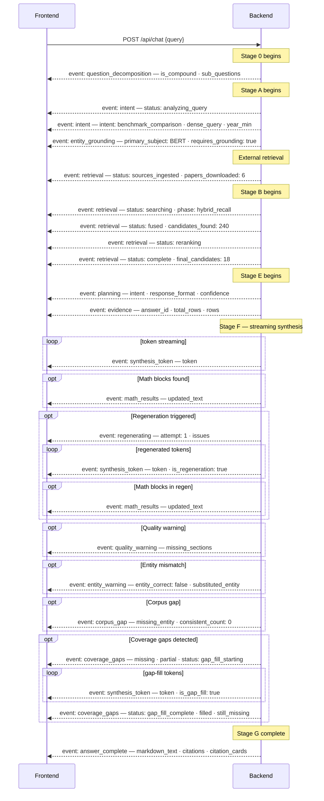

### Complete SSE Event Reference

| Event | Key Payload Fields | When Emitted |
|-------|-------------------|--------------|
| `question_decomposition` | `is_compound`, `sub_questions`, `reasoning` | When compound query detected (Stage 0) |
| `intent` | `status`, `intent`, `dense_query`, `year_min`, `year_max` | Start + after classification |
| `entity_grounding` | `primary_subject`, `entity_type`, `exclusion_count`, `requires_grounding` | When specific entity detected |
| `retrieval` | `status`, `phase`, `candidates_found`, `final_candidates`, `papers_downloaded` | Multiple times through retrieval |
| `planning` | `intent`, `response_format`, `confidence`, `is_sufficient` | After planner |
| `evidence` | `answer_id`, `total_rows`, `confidence`, `rows[]` | Before synthesis |
| `synthesis_token` | `token`, `is_regeneration`, `is_gap_fill` | Streaming synthesis / regen / gap fill |
| `math_results` | `updated_text` | After math sandbox executes code blocks |
| `regenerating` | `attempt`, `issues`, `previous_score` | If quality insufficient |
| `quality_warning` | `missing_sections` | If required sections absent |
| `entity_warning` | `entity_correct`, `substituted_entity`, `confidence` | If entity mismatch post-synthesis |
| `corpus_gap` | `missing_entity`, `consistent_count`, `total_count` | If entity not in corpus |
| `coverage_gaps` | `missing`, `partial`, `status`, `filled`, `still_missing`, `new_evidence_rows` | Coverage audit + gap fill |
| `answer_complete` | `markdown_text`, `citations`, `citation_cards`, `quality_meta`, `uncertainty_flags` | Pipeline complete |
| `error` | `message`, `suggestion` | On pipeline error |

---

## Configuration Reference

All settings are loaded from environment variables (`.env` file or shell). The `Settings` dataclass in `config.py` provides typed defaults for every field.

### Core Model Settings

| Variable | Default | Description |
|----------|---------|-------------|
| `GROQ_API_KEY` | — | Groq API key (required) |
| `GROQ_MODEL_PRIMARY` | `llama-3.3-70b-versatile` | Main synthesis + reranking model |
| `GROQ_MODEL_FAST` | `llama-3.1-8b-instant` | Intent classification, compression, extraction |
| `EMBEDDING_MODEL` | `BAAI/bge-large-en-v1.5` | Dense retrieval embeddings |
| `RERANKER_MODEL` | `BAAI/bge-reranker-v2-m3` | Cross-encoder reranker |
| `NLI_MODEL` | `cross-encoder/nli-deberta-v3-base` | Citation entailment verification |

### Retrieval Tuning

| Variable | Default | Description |
|----------|---------|-------------|
| `BM25_TOP_K` | `500` | Candidates per BM25 query |
| `DENSE_TOP_K` | `500` | Candidates per dense query |
| `FUSED_TOP_K` | `300` | Candidates after RRF fusion |
| `RRF_K` | `60` | RRF smoothing constant |
| `RERANKED_TOP_K` | `100` | Candidates after cross-encoder |
| `FINAL_EVIDENCE_TOP_K` | `25` | Final evidence set size |
| `GRAPH_EXPANSION_LIMIT` | `25` | Max citation graph expansion |
| `PASSAGE_CHUNK_TOKENS` | `512` | Sliding window size (tokens) |
| `PASSAGE_STRIDE_TOKENS` | `410` | Sliding window stride (~80% overlap) |
| `BM25_K1` | `1.2` | BM25 term saturation parameter |
| `BM25_B` | `0.85` | BM25 length normalization parameter |
| `HYBRID_ALPHA` | `0.7` | 70% dense, 30% BM25 in hybrid weighting |

### Entity Grounding

| Variable | Default | Description |
|----------|---------|-------------|
| `ENTITY_EXTRACTION_ENABLED` | `True` | Enable entity profile extraction |
| `ENTITY_GROUNDING_PENALTY` | `0.20` | Score penalty for wrong-entity chunks |
| `ENTITY_GROUNDING_BOOST` | `0.12` | Score boost for matching-entity chunks |
| `ENTITY_SPECIFICITY_THRESHOLD` | `0.60` | Min specificity to activate grounding |
| `MIN_ENTITY_CONSISTENT_CANDIDATES` | `2` | Min consistent candidates before corpus_gap abstention |
| `CORPUS_GAP_ABSTENTION_ENABLED` | `True` | Enable corpus gap detection |
| `ENTITY_VERIFY_POST_SYNTHESIS` | `True` | Post-synthesis entity consistency check |
| `ENTITY_VERIFY_CONFIDENCE_THRESHOLD` | `0.70` | Min confidence to prepend entity warning |

### Quality Thresholds

| Variable | Default | Description |
|----------|---------|-------------|
| `SYNTHESIS_TEMPERATURE` | `0.15` | LLM temperature for synthesis |
| `CONFIDENCE_THRESHOLD` | `0.40` | Min sigmoid score for is_retrieval_sufficient |
| `NLI_ENTAILMENT_THRESHOLD` | `0.55` | Min NLI score to mark citation as supported |
| `RERANKER_SCORE_THRESHOLD` | `0.30` | Hard threshold on sigmoid(CE score) |
| `RERANKER_ELBOW_DROP` | `0.25` | Max score drop between consecutive results |

### External Search

| Variable | Default | Description |
|----------|---------|-------------|
| `EXA_API_KEY` | — | Exa Search API key |
| `EXA_AUTO_FETCH` | `True` | Enable Exa primary search |
| `EXA_NUM_RESULTS` | `40` | Results per Exa query |
| `EXA_MAX_CHARACTERS` | `40000` | Max chars per Exa result |
| `EXA_USE_AUTOPROMPT` | `True` | AI-enhanced query at Exa |
| `EXA_HIGHLIGHT_SENTENCES` | `5` | Highlight sentences per result |
| `EXA_LIVECRAWL_TIMEOUT_MS` | `8000` | Exa live crawl timeout |
| `TAVILY_API_KEY` | — | Tavily API key |
| `TAVILY_AUTO_FETCH` | `True` | Enable Tavily fallback |
| `TAVILY_MAX_RESULTS` | `8` | Max Tavily results |
| `TAVILY_SEARCH_DEPTH` | `advanced` | Tavily search depth |
| `S2_API_KEY` | — | Semantic Scholar API key (optional) |
| `S2_AUTO_FETCH` | `True` | Enable S2 supplement |
| `COLBERT_ENABLED` | `False` | Enable ColBERT retrieval lane |

### Storage Paths

| Variable | Default | Description |
|----------|---------|-------------|
| `DB_PATH` | `data/db/nexus.db` | SQLite database path |
| `INDEX_PATH` | `data/indexes` | Serialized index directory |
| `PDF_STORE_PATH` | `data/pdfs` | Uploaded PDF storage |
| `PARSED_PATH` | `data/parsed` | Parsed paper cache |

---

## API Reference

### `POST /api/chat`
Main research query endpoint. Returns `text/event-stream`.

**Request body:**
```json
{
  "query": "Compare BERT and RoBERTa on GLUE benchmark",
  "conversation_id": "abc123",
  "corpus_id": "default",
  "recency_filter": "any",
  "intent_override": null
}
```

| Field | Type | Options | Description |
|-------|------|---------|-------------|
| `query` | `string` | — | Research question (required) |
| `conversation_id` | `string` | — | Session ID (auto-generated if omitted) |
| `recency_filter` | `string` | `any` `1y` `2y` `3y` | Force recency constraint |
| `intent_override` | `string` | any intent type | Skip intent classification |

**Response:** `text/event-stream` — see [SSE Contract](#-streaming-sse-contract).

---

### `POST /api/ingest`
Upload a PDF for corpus ingestion.

**Request:** `multipart/form-data` with `file` field (PDF only).

**Response:**
```json
{
  "job_id": "abc12345",
  "paper_id": "sha256_prefix",
  "title": "Attention Is All You Need",
  "chunks_created": 147,
  "status": "completed"
}
```

---

### Other Endpoints

| Method | Path | Description |
|--------|------|-------------|
| `GET` | `/api/papers` | List all corpus papers (limit param) |
| `GET` | `/api/papers/{id}` | Paper metadata with source/PDF URLs |
| `GET` | `/api/papers/search` | Search papers by title/abstract with filters |
| `GET` | `/api/evidence/{answer_id}` | Complete evidence table for a past answer |
| `GET` | `/api/conversations` | List all conversation sessions |
| `GET` | `/api/conversations/{id}/messages` | Messages for a conversation |
| `POST` | `/api/indexes/rebuild` | Rebuild BM25 + dense indexes from scratch |
| `GET` | `/api/health/pipeline` | Detailed: index sizes, corpus stats, graph, config |
| `GET` | `/api/audit/missing-years` | List papers without year metadata |
| `GET` | `/health` | Basic health check with index sizes |

---

## Quick Start

### Prerequisites

```bash
# Python 3.11+
python --version

# Clone
git clone https://github.com/Aashu-11/nexusscholar
cd nexusscholar
```

### 1. Environment Setup

```bash
# Create and activate virtual environment
python -m venv backend/venv
source backend/venv/bin/activate       # Linux/Mac
# backend\venv\Scripts\activate        # Windows

# Install dependencies
pip install -r backend/requirements.txt
```

### 2. Configure API Keys

Create `backend/.env`:

```env
# Required
GROQ_API_KEY=gsk_...

# Recommended (primary search)
EXA_API_KEY=...

# Recommended (fallback search + math web verification)
TAVILY_API_KEY=...

# Optional (metadata enrichment)
S2_API_KEY=...
```

### 3. Start the Backend

```bash
python -m uvicorn backend.main:app --host 0.0.0.0 --port 8000 --reload
```

On first start, NexusScholar will:
1. Initialize the SQLite database and embedding cache
2. Build BM25 and dense indexes (empty corpus on first run)
3. Compute PageRank on the citation graph
4. Warn about any papers missing year metadata
5. Attempt to build ColBERT index if `COLBERT_ENABLED=True`

### 4. Ingest Papers

```bash
# Via API
curl -X POST http://localhost:8000/api/ingest \
  -F "file=@attention_is_all_you_need.pdf"

# Check corpus size
curl http://localhost:8000/api/papers | jq '.total'
```

### 5. Ask a Research Question

```bash
curl -N -X POST http://localhost:8000/api/chat \
  -H "Content-Type: application/json" \
  -d '{"query": "How does multi-head attention work?"}' \
  --no-buffer
```

### 6. Frontend

```bash
cd frontend/src
npm install
npm run dev
# Vite dev server at http://localhost:5173
```

---

## Performance Characteristics

| Stage | p50 | p95 | Notes |
|-------|-----|-----|-------|
| Question decomposition | 150ms | 300ms | Groq fast-model, skipped for atomic queries |
| Query understanding | 180ms | 320ms | Groq fast-model calls (intent + rewrite) |
| External retrieval | 1,200ms | 2,800ms | Exa + S2 concurrent — network-bound |
| Hybrid recall | 45ms | 120ms | Local BM25 + FAISS — CPU-bound |
| Cross-encoder reranking | 280ms | 580ms | sentence-transformers — CPU-bound |
| Listwise reranking | 200ms | 400ms | Groq fast-model call |
| PRF + graph expansion | 60ms | 150ms | Local computation |
| Contextual compression | 180ms | 380ms | Groq fast-model call |
| Evidence building | 25ms | 60ms | Local computation |
| Synthesis — first token | ~600ms | ~1,200ms | Groq streaming TTFT |
| Synthesis — full response | ~2,800ms | ~5,000ms | 800–2,000 word response |
| Math sandbox execution | 50ms | 400ms | Subprocess, 8s hard timeout |
| Math web verification | 600ms | 1,500ms | Tavily + Groq, non-blocking |
| Self-evaluation | 200ms | 400ms | Groq fast-model call |
| Citation verification | 240ms | 480ms | NLI model (CPU) |
| Coverage verification | 200ms | 500ms | Groq fast-model, compound queries only |
| **Total — typical query** | **~5–8s** | **~12s** | First token ~3s, full response ~8s |

### Scaling Notes

- **CPU-only**: Fully functional. FAISS uses flat index for < 10,000 chunks; IVF for larger corpora.
- **Memory**: ~2 GB base RAM. BAAI/bge-large uses ~1.4 GB, reranker uses ~400 MB.
- **Concurrency**: FastAPI async + aiosqlite WAL enable concurrent requests without blocking.
- **Embedding cache**: Persistent SQLite vectors. Restarts re-use cached embeddings — index rebuilds are fast.
- **ColBERT**: Optional 4th retrieval lane. Must be pre-built before enabling (`COLBERT_ENABLED=False` default).
- **Math sandbox**: Each code block forks a subprocess with an 8-second timeout. Failures fall through silently.

---

## Directory Structure

```
nexusscholar/
│
├── backend/
│   ├── main.py                          # FastAPI entrypoint, lifespan, global singletons
│   ├── config.py                        # Settings dataclass, all env vars, startup validation
│   ├── requirements.txt
│   │
│   ├── api/routes/
│   │   ├── chat.py                      # Main SSE pipeline orchestrator
│   │   ├── ingest.py                    # PDF ingestion endpoint
│   │   ├── papers.py                    # Corpus management + search endpoints
│   │   └── evidence.py                  # Evidence explorer, conversations, indexes, health, audit
│   │
│   ├── ingestion/
│   │   ├── pdf_parser.py               # Grobid → Marker → PyMuPDF (3-tier fallback)
│   │   ├── chunker.py                  # 5-level multi-granular chunker (512t/410s windows)
│   │   ├── claim_extractor.py          # Sentence-level claim extraction
│   │   ├── table_extractor.py          # Markdown table → key:value serialization
│   │   ├── normalizer.py               # Metadata normalization (year/venue/DOI)
│   │   ├── graph_builder.py            # Citation graph construction + PageRank
│   │   └── service.py                  # Ingestion orchestration + index rebuild
│   │
│   ├── indexing/
│   │   ├── bm25_index.py               # rank-bm25 + compound tokens + Snowball stemming
│   │   ├── dense_index.py              # BAAI/bge-large + FAISS + async batch embedding
│   │   ├── colbert_index.py            # ColBERT late-interaction (optional)
│   │   ├── embedding_cache.py          # Persistent SQLite embedding cache
│   │   └── metadata_store.py           # aiosqlite metadata + evidence store
│   │
│   ├── retrieval/
│   │   ├── query_classifier.py         # 10-intent Groq classifier
│   │   ├── query_rewriter.py           # 5-form parallel rewriter + HyDE generation
│   │   ├── entity_extractor.py         # QueryEntityProfile + exclusion entity extraction
│   │   ├── hybrid_recall.py            # BM25+Dense+HyDE+ColBERT → RRF → MMR
│   │   ├── reranker.py                 # Cross-encoder + multi-signal scoring + listwise
│   │   ├── graph_expander.py           # Citation graph expansion (cited-by + co-citation)
│   │   ├── chunk_expander.py           # Parent-child + sibling passage expansion
│   │   ├── compressor.py               # Entity-aware Groq contextual compression
│   │   └── pseudo_relevance_feedback.py # PRF term expansion + BM25 re-query
│   │
│   ├── generation/
│   │   ├── groq_client.py              # Groq API client (retry, rate-limit, streaming)
│   │   ├── synthesizer.py              # LLaMA3.3-70B + 10 hard rules + math sandbox trigger
│   │   ├── question_decomposer.py      # Compound question detection + sub-question splitting
│   │   ├── evidence_builder.py         # EvidenceTable + EvidenceRow construction
│   │   ├── evidence_dedup.py           # Near-duplicate evidence row removal
│   │   ├── planner.py                  # Response format + confidence + abstention logic
│   │   ├── verifier.py                 # Citation tag validation + NLI entailment
│   │   ├── entity_verifier.py          # Post-synthesis entity consistency check
│   │   ├── self_evaluator.py           # 8-dimension quality scoring + regeneration trigger
│   │   ├── coverage_verifier.py        # Per-sub-question coverage audit + gap fill
│   │   ├── math_sandbox.py             # Isolated Python subprocess arithmetic execution
│   │   ├── math_web_verifier.py        # Web-search-grounded LLM verification of math results
│   │   └── markdown_fixer.py           # Required-section validator + LLM appender
│   │
│   ├── integrations/
│   │   ├── exa_client.py               # Exa neural search (primary external source)
│   │   ├── tavily_client.py            # Tavily web search (fallback + math verification)
│   │   ├── semantic_scholar.py         # S2 citation metadata + peer-review inference
│   │   ├── arxiv_client.py             # arXiv direct fetch
│   │   └── source_urls.py              # Canonical academic URL + PDF URL builder
│   │
│   └── citation/
│       ├── resolver.py                 # CIT:id tag → evidence row mapping
│       └── renderer.py                 # Citation cards with full metadata
│
├── frontend/
│   ├── package.json
│   ├── scripts/
│   │   ├── ingest_corpus.py            # Bulk corpus ingestion helper
│   │   └── build_indexes.py            # Index rebuild utility
│   └── src/
│       ├── vite.config.ts
│       ├── lib/
│       │   └── api.ts                  # API client + SSE event consumer
│       ├── hooks/
│       │   ├── useChat.ts              # Chat state management
│       │   ├── useStreaming.ts          # SSE streaming hook
│       │   └── useEvidence.ts          # Evidence table data hook
│       ├── stores/
│       │   └── evidenceStore.ts        # Evidence state store
│       └── components/
│           ├── CitationChip.tsx        # Inline citation tag renderer
│           └── ConsensusBar.tsx        # Evidence consensus visualizer
│
└── data/                               # Auto-created at startup
    ├── db/nexus.db                     # SQLite database (WAL mode)
    ├── indexes/                        # BM25 + dense index files
    ├── pdfs/                           # Uploaded PDF store
    └── parsed/                         # Parsed paper cache
```

---

<div align="center">

---

```
━━━━━━━━━━━━━━━━━━━━━━━━━━━━━━━━━━━━━━━━━━━━━━━━━━━━━━━━━━━━━━━━━━━━━━━━━━━━━
  Every claim traced to evidence.   Every entity verified.   Every answer earned.
━━━━━━━━━━━━━━━━━━━━━━━━━━━━━━━━━━━━━━━━━━━━━━━━━━━━━━━━━━━━━━━━━━━━━━━━━━━━━
```

**Built with love by AAYUSH for researchers who demand precision, not plausibility**

*NexusScholar · Enterprise Research Intelligence · v1.0.0*

</div>
