<div align="center">

```
███╗   ██╗███████╗██╗  ██╗██╗   ██╗███████╗    ███████╗ ██████╗██╗  ██╗ ██████╗ ██╗      █████╗ ██████╗
████╗  ██║██╔════╝╚██╗██╔╝██║   ██║██╔════╝    ██╔════╝██╔════╝██║  ██║██╔═══██╗██║     ██╔══██╗██╔══██╗
██╔██╗ ██║█████╗   ╚███╔╝ ██║   ██║███████╗    ███████╗██║     ███████║██║   ██║██║     ███████║██████╔╝
██║╚██╗██║██╔══╝   ██╔██╗ ██║   ██║╚════██║    ╚════██║██║     ██╔══██║██║   ██║██║     ██╔══██║██╔══██╗
██║ ╚████║███████╗██╔╝ ██╗╚██████╔╝███████║    ███████║╚██████╗██║  ██║╚██████╔╝███████╗██║  ██║██║  ██║
╚═╝  ╚═══╝╚══════╝╚═╝  ╚═╝ ╚═════╝ ╚══════╝    ╚══════╝ ╚═════╝╚═╝  ╚═╝ ╚═════╝ ╚══════╝╚═╝  ╚═╝╚═╝  ╚═╝
```

### *Enterprise AI Research Intelligence Platform*

---

[](https://python.org)
[](https://fastapi.tiangolo.com)
[](https://llamaindex.ai)
[](https://groq.com)
[](LICENSE)

---

> **NexusScholar** is a production-grade Retrieval-Augmented Generation (RAG) system purpose-built for  
> scientific literature analysis. It retrieves, synthesizes, and cites research papers with enterprise-level  
> accuracy, anti-hallucination guarantees, and streaming SSE delivery — all grounded exclusively in indexed evidence.

---

</div>

## ✦ Table of Contents

- [System Overview](#-system-overview)
- [Architecture at a Glance](#-architecture-at-a-glance)
- [The Full Query Pipeline](#-the-full-query-pipeline)
- [Ingestion Pipeline](#-ingestion-pipeline-depth)
- [Indexing Layer](#-indexing-layer)
- [Retrieval System](#-retrieval-system)
- [Entity Grounding & Anti-Hallucination](#-entity-grounding--anti-hallucination-system)
- [LlamaIndex Integration Layer](#-llamaindex-integration-layer)
- [Generation Pipeline](#-generation-pipeline)
- [Verification & Quality System](#-verification--quality-system)
- [External Integrations](#-external-integrations)
- [Streaming SSE Contract](#-streaming-sse-contract)
- [Evaluation Harness](#-evaluation-harness)
- [Configuration Reference](#-configuration-reference)
- [API Reference](#-api-reference)
- [Quick Start](#-quick-start)
- [Performance Characteristics](#-performance-characteristics)
- [Directory Structure](#-directory-structure)

---

## ✦ System Overview

NexusScholar is not a chatbot. It is a **research synthesis engine** — a system that thinks the way a PhD student does when conducting a literature review, but executes in seconds instead of weeks.

When a researcher asks *"Compare BERT, RoBERTa, and DeBERTa on GLUE and SuperGLUE"*, NexusScholar does not generate an answer from training memory. It:

1. **Classifies intent** — understands this is a `benchmark_comparison` requiring tables and recent papers
2. **Rewrites the query** — into 5 parallel retrieval forms optimized for BM25, dense embeddings, HyDE, and arXiv
3. **Decomposes the question** — into 6 sub-questions (one per model × benchmark) to prevent entity crowding
4. **Fetches live papers** — from Exa, Tavily, and Semantic Scholar, hydrates the corpus in real-time
5. **Retrieves at 5 granularities** — document, section, passage, claim, and table chunks
6. **Fuses with RRF** — across BM25, dense, HyDE, ColBERT lanes with intent-tuned weights
7. **Reranks twice** — pointwise cross-encoder, then listwise LLM reranking
8. **Applies LlamaIndex postprocessors** — trims noise, reorders for LLM attention, injects parent context
9. **Extracts structured claims** — pre-parses every quantitative finding before the LLM writes a word
10. **Synthesizes with 9 hard rules** — citation tags, entity locks, peer-review labels, abstention logic
11. **Verifies the answer** — NLI entailment checks, entity consistency scan, self-evaluation + optional regeneration

Every factual sentence is traceable to a specific chunk of a specific paper.

---

## ✦ Architecture at a Glance

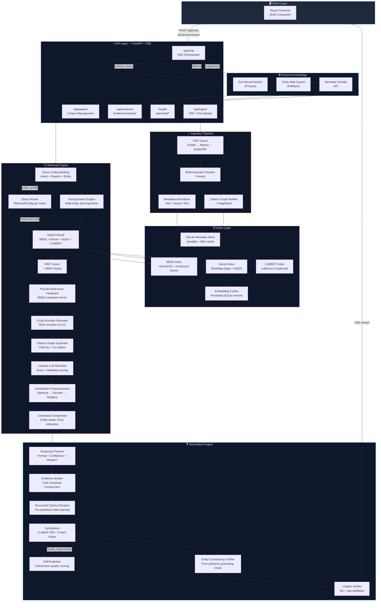

---

## ✦ The Full Query Pipeline

The following is the exact execution order of every stage for a single query request. The pipeline is a directed acyclic graph with two feedback loops (PRF expansion and self-evaluation regeneration).

```mermaid
flowchart TD
    START(["🚀 POST /api/chat\n{query, corpus_id, recency_filter}"])

    subgraph STAGE_A["━━━ STAGE A · Query Understanding ━━━"]
        A1["Intent Classification\nGroq fast-model · 10 intent types"]
        A2["Query Rewriting\nasyncio.gather — 5 parallel forms:\ndense · BM25 · HyDE · acronym · paper_title"]
        A3["Entity Extraction\nQueryEntityProfile:\nprimary_subject · exclusion_entities · specificity_score"]
        A4{{"specificity_score ≥ 0.6?"}}
        A5["requires_entity_grounding = TRUE\nActivates entity reranking penalty\nentity-aware compression\nentity lock in synthesizer"]
        A6["requires_entity_grounding = FALSE\nStandard pipeline path"]
        A7["Year Constraint Resolution\nImplicit recency detection\nlatest / recent / state of the art"]
        A8["Query Routing\nRetrievalConfig per intent\nBM25+dense weights · section priority\ntop_k multiplier · recency cutoff"]
    end

    subgraph STAGE_EXT["━━━ STAGE EXT · External Retrieval ━━━"]
        EXT1["Exa Neural Search\nPrimary — §7.4.1\narXiv queries · year filter · highlights · autoprompt"]
        EXT2{{"≥ 2 Exa results?"}}
        EXT3["Tavily Fallback\nStrict fallback — §7.4.2\nadvanced depth · academic domains"]
        EXT4["Semantic Scholar\nConcurrent arXiv/DOI lookup\ncitation counts · venue · peer-review"]
        EXT5["Hydrate Corpus\nPDF download → parse → chunk\n→ index → SSE: sources_ingested"]
    end

    subgraph STAGE_B["━━━ STAGE B · Hybrid Recall ━━━"]
        B1["BM25 Recall\nrank-bm25 · compound token protection\nstopword removal · stemming\nx top_k_multiplier x bm25_weight"]
        B2["Dense Recall\nBAAI/bge-large-en-v1.5 · FAISS IVF\nquery prefix injection\nx top_k_multiplier x dense_weight"]
        B3["HyDE Lane\nHypothetical Document Embeddings\nGroq generates fake answer → embed → search"]
        B4["ColBERT Lane\nLate-interaction token matching\noptional · opt-in"]
        B5["Sub-Question Engine\nFor 2+ entities in comparison intents:\ndecompose → mini recall x N sub-queries\n→ RRF merge with 0.6x score discount"]
        B6["RRF Fusion\nRRF(d) = sum 1/(k+rank)\nk=60 · top_FUSED_TOP_K=80"]
        B7["MMR Deduplication\nlambda=0.7 (0.85 for entity-grounded)\nBalance relevance vs diversity"]
    end

    subgraph STAGE_C["━━━ STAGE C · Re-ranking ━━━"]
        C1["Metadata Resolution\nFetch paper titles · years · venues\nfrom SQLite for all fused candidates"]
        C2["Year Filtering\nApply year_min / year_max constraints\n+ recency_cutoff_year from RetrievalConfig"]
        C3["Paper-First Filtering\nBoost chunks from explicitly named papers\nTitle match → boost rrf_score x 1.5"]
        C4["Parent-Child Expansion\nFor passage chunks: fetch parent section\nInject parent_context into chunk metadata"]
        C5["Sibling Passage Expansion\nFetch adjacent passages by char offset\nwindow=1 for top-8 candidates"]
        C6["Cross-Encoder Reranker\nBAAI/bge-reranker-v2-m3\nMulti-signal score:\nrelevance · recency · citation_count\nPageRank · section_weight · entity_consistency"]
        C7["Pseudo-Relevance Feedback\nExtract expansion terms from top-5\nBM25 re-query → inject up to 10 new candidates"]
        C8["Citation Graph Expansion\ncited-by · references · co-citation clusters\nshared-dataset · same-venue+topic"]
        C9["Final Cross-Encoder Rerank\ntop_FINAL_EVIDENCE_TOP_K=18\nYear filter · 3 chunks/paper limit"]
        C10["Listwise LLM Reranking\nGroq: given evidence rows, rank 1-N\nTop-12 selected with paper metadata context"]
        C11["Section Priority Boost\napply_section_boost from RetrievalConfig\nresults/experiments/evaluation x1.15 etc."]
    end

    subgraph STAGE_D["━━━ STAGE D · Postprocessing ━━━"]
        D1{{"requires_entity_grounding?"}}
        D2["LlamaIndex Postprocessors\n1. SentenceEmbeddingOptimizer p=0.70\n   Trim irrelevant sentences via embedding sim\n2. LongContextReorder\n   Best chunks to edges of context window\n3. MetadataReplacementPostProcessor\n   Replace chunk text with parent_context window"]
        D3["Entity-Aware Groq Compression\nCOMPRESS_PROMPT_ENTITY_AWARE\nReturns: WRONG_ENTITY · AMBIGUOUS · IRRELEVANT\nor extracted relevant sentences only"]
    end

    subgraph STAGE_E["━━━ STAGE E · Evidence Construction ━━━"]
        E1["Corpus Gap Check\nCount entity-consistent candidates\n< MIN_ENTITY_CONSISTENT → abstain"]
        E2["Response Planner\nformat · confidence_score · should_abstain\nMulti-signal: score + count + diversity + peer-review"]
        E3["Evidence Table Builder\nEvidenceRow x N:\nevidence_id · paper_title · year · venue\nchunk_text · relevance_score · source_url\nis_peer_reviewed · is_preprint · is_retracted\nnli_entailment_score · parent_context"]
        E4["Evidence Deduplication\nRemove near-duplicate rows"]
        E5["Structured Claims Extractor\nPre-synthesis LLM pass:\nEvidenceClaim list · contradictions\nresearch_gaps · recommended_format"]
    end

    subgraph STAGE_F["━━━ STAGE F · Synthesis ━━━"]
        F1["LLaMA3-70B via Groq\nSYSTEM: 9 Hard Citation Rules\ndepth/quality requirements\nLaTeX math notation rules\nchain-of-arithmetic rules"]
        F2["Token Budget Manager\nTrim evidence rows to fit 11,800 token limit\n2/3 text + 1/3 parent_context per row"]
        F3["Structured Claims Injection\nPre-parsed quantitative claims injected\nForce synthesizer to cite all metrics"]
        F4["Entity Grounding Section\nInject exclusion entities + primary subject\nbefore evidence table for entity-locked queries"]
        F5["Streaming SSE\nToken-by-token via synthesis_token events\nMarkdown table formatter post-process"]
    end

    subgraph STAGE_G["━━━ STAGE G · Verification and Quality ━━━"]
        G1["Self-Evaluator\n9 dimensions: completeness · citation_density\nspecificity · coherence · table_quality\nentity_consistency · parametric_contamination\ndepth · section_structure\nComposite threshold → needs_regeneration?"]
        G2{{"needs_regeneration\nAND attempts < 2?"}}
        G3["Regeneration\nPatch TaskPlan with issue hints\nRe-synthesize with targeted instructions"]
        G4["Entity Consistency Verifier\nPost-synthesis: did LLM use correct entity?\nConfidence > 0.70 → prepend warning banner"]
        G5["Citation Verifier\nExtract all CIT:id tags\nValidate vs evidence_id set\nNLI entailment score per claim\nFlag: hallucinated · retracted · preprint"]
        G6["Citation Renderer\nReplace CIT:id with N numbered refs\nBuild citation cards with full metadata"]
        G7["Save to DB\nevidence_table · answer · conversation\nmessages · citations"]
        G8(["✅ answer_complete SSE\nmarkdown_text · citations · quality_meta\ncitation_cards · uncertainty_flags"])
    end

    START --> A1 --> A2 --> A3
    A3 --> A4
    A4 -->|"Yes"| A5
    A4 -->|"No"| A6
    A5 & A6 --> A7 --> A8
    A8 --> EXT1
    EXT1 --> EXT2
    EXT2 -->|"No"| EXT3
    EXT2 -->|"Yes skip Tavily"| EXT4
    EXT3 --> EXT4
    EXT4 --> EXT5
    EXT5 --> B1 & B2 & B3
    A8 --> B1 & B2
    B3 --> B6
    B4 --> B6
    B5 --> B6
    B1 --> B6
    B2 --> B6
    A3 --> B5
    B6 --> B7
    B7 --> C1 --> C2 --> C3 --> C4 --> C5
    C5 --> C6
    C6 --> C7 --> C8
    C8 --> C9 --> C10 --> C11
    C11 --> D1
    D1 -->|"No"| D2
    D1 -->|"Yes"| D3
    D2 --> E1
    D3 --> E1
    E1 -->|"coverage OK"| E2
    E1 -->|"gap detected"| G8
    E2 --> E3 --> E4 --> E5
    E5 --> F2
    F1 & F3 & F4 --> F2
    F2 --> F5
    F5 --> G1
    G1 --> G2
    G2 -->|"Yes"| G3 --> F5
    G2 -->|"No"| G4
    G4 --> G5 --> G6 --> G7 --> G8

    style STAGE_A fill:#0f172a,stroke:#6366f1,color:#c7d2fe
    style STAGE_EXT fill:#0f172a,stroke:#10b981,color:#d1fae5
    style STAGE_B fill:#0f172a,stroke:#f59e0b,color:#fef3c7
    style STAGE_C fill:#0f172a,stroke:#ef4444,color:#fee2e2
    style STAGE_D fill:#0f172a,stroke:#8b5cf6,color:#ede9fe
    style STAGE_E fill:#0f172a,stroke:#06b6d4,color:#cffafe
    style STAGE_F fill:#0f172a,stroke:#ec4899,color:#fce7f3
    style STAGE_G fill:#0f172a,stroke:#22c55e,color:#dcfce7
```

---

## ✦ Ingestion Pipeline (Depth)

Every document entering NexusScholar goes through a deterministic transformation pipeline that produces **5 parallel representations** of every paper — each optimized for a different retrieval scenario.

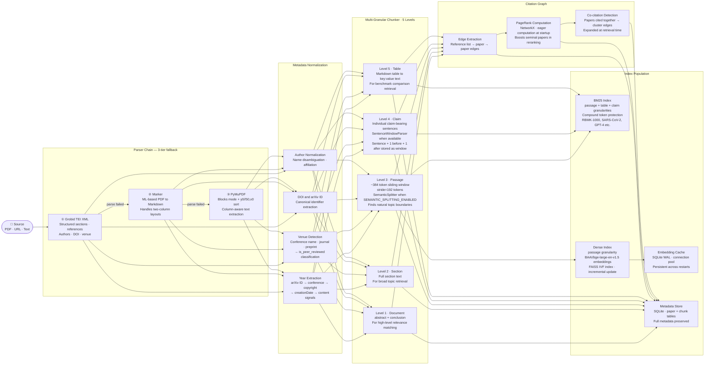

### Chunk Granularity Decision Matrix

| Level | Granularity | Size | Best For | Index |
|-------|-------------|------|----------|-------|
| 1 | Document | Full abstract + conclusion | High-level topic matching, `paper_lookup` intent | Dense |
| 2 | Section | Full section (~1000–3000 tokens) | Broad survey retrieval, context expansion | BM25 |
| 3 | Passage | ~384 tokens, 50% overlap | Standard retrieval — the primary retrieval unit | BM25 + Dense |
| 4 | Claim | 1–3 sentences | Fact verification, specific claim retrieval | BM25 |
| 5 | Table | Serialized table rows | Benchmark comparison, `benchmark_comparison` intent | BM25 |

---

## ✦ Indexing Layer

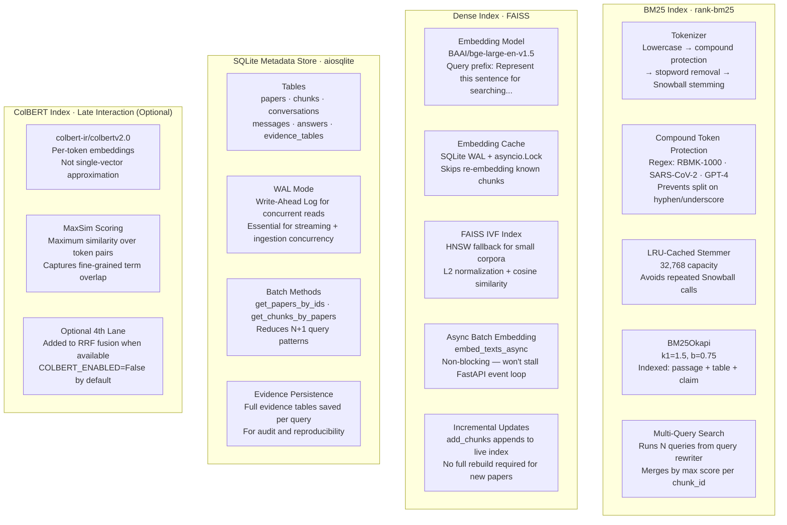

---

## ✦ Retrieval System

The retrieval system is the heart of NexusScholar's accuracy. It runs **four parallel lanes**, fuses them with Reciprocal Rank Fusion, and applies multiple refinement passes.

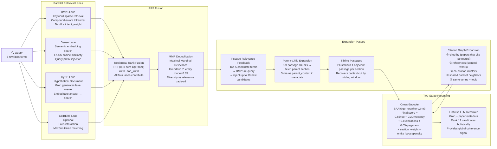

### Intent → RetrievalConfig Routing Table

| Intent | BM25 Weight | Dense Weight | Section Priority | Top-K Mult | Recency | Tables |
|--------|-------------|--------------|------------------|------------|---------|--------|
| `benchmark_comparison` | 0.9× | 1.4× | results, experiments, evaluation | 1.3× | last 4 years | ✓ boosted |
| `literature_survey` | 1.5× | 1.0× | abstract, intro, related_work | 1.5× | none | ✗ |
| `paper_lookup` | 2.0× | 0.4× | abstract | 0.8× | none | ✗ |
| `method_explanation` | 1.0× | 1.5× | method, architecture, approach | 1.1× | none | ✗ |
| `trend_analysis` | 1.1× | 1.2× | abstract, intro, conclusion | 1.3× | last 3 years | ✗ |
| `dataset_discovery` | 1.4× | 1.0× | dataset, experiments | 1.1× | none | ✓ boosted |
| `definition` | 0.9× | 1.4× | abstract, intro, related_work | 0.9× | none | ✗ |
| `contradiction_check` | 1.2× | 1.2× | results, discussion, limitations | 1.4× | none | ✗ |
| `general` | 1.0× | 1.0× | — | 1.0× | none | ✗ |

### Multi-Signal Reranker Score Formula

```
final_score(d) =
    0.65 × cross_encoder_score(query, chunk)
  + 0.20 × recency_score(paper.year)           // log decay from current year
  + 0.10 × citation_score(paper.citation_count) // log-normalized
  + 0.05 × pagerank_score(paper.paper_id)       // NetworkX PageRank
  + section_weight(chunk.section_tag)            // abstract=+0.1, methods=+0.05
  + entity_boost(entity_profile, chunk)          // +0.12 match / -0.50 wrong entity
```

---

## ✦ Entity Grounding & Anti-Hallucination System

This is NexusScholar's most critical safety system. It prevents **entity substitution hallucinations** — the failure mode where an LLM answers about TRIGA reactors when asked about RBMK reactors, or answers about RoBERTa when asked specifically about BERT.

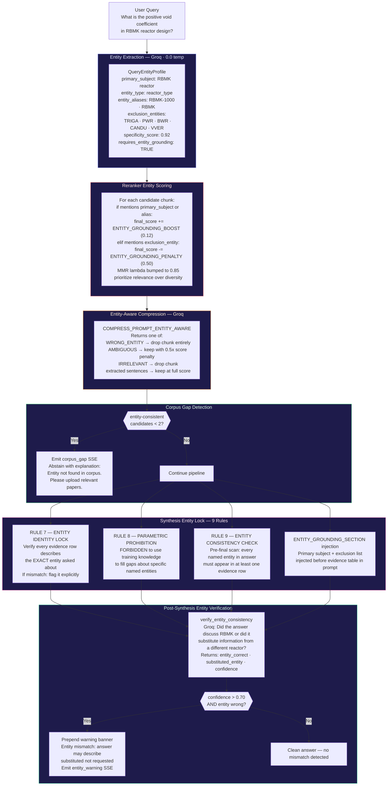

---

## ✦ LlamaIndex Integration Layer

The LlamaIndex integration adds **five orthogonal accuracy enhancements** on top of the existing pipeline. Each is independently feature-flagged and has a hard fallback to the original code.

```mermaid
flowchart TD
    subgraph QUERY_ROUTING["① Query Routing — QUERY_ROUTING_ENABLED"]
        QR1["get_retrieval_config(intent, entity_profile)\n→ RetrievalConfig dataclass\n  bm25_weight · dense_weight\n  section_priority · top_k_multiplier\n  force_table_chunks · recency_cutoff_year"]
        QR2["apply_section_boost\nPost-reranking score adjustment\nSections in priority list get +15% score\nTable chunks get +22.5% when force_table_chunks=True"]
    end

    subgraph SUB_Q["② Sub-Question Engine — SUB_QUESTION_ENABLED"]
        SQ1["Activation: intent in benchmark_comparison\nliterature_survey · contradiction_check\nAND n_entities>=2 OR comparison markers >=1\nOR named_entities>=3"]
        SQ2["decompose_query(query, intent, groq)\nGroq decomposes into 3-7 focused sub-questions\nExample: Compare BERT/RoBERTa/DeBERTa\n→ BERT performance on GLUE\n→ RoBERTa performance on GLUE\n→ DeBERTa performance on GLUE\n→ model comparison GLUE survey"]
        SQ3["run_sub_question_recall\nmini BM25+dense per sub-query\ntop_k=15 each → RRF merge"]
        SQ4["merge_sub_question_candidates\nNew chunks: 0.6x score discount\nExisting chunks: +30% RRF boost\nSolves entity crowding in embedding space"]
    end

    subgraph POSTPROC["③ Postprocessor Chain — LLAMAINDEX_POSTPROCESSORS_ENABLED"]
        PP1["RetrievalCandidate list\n→ NodeWithScore list\nTextNode + score + all metadata preserved"]
        PP2["SentenceEmbeddingOptimizer\npercentile_cutoff=0.70\nFor each chunk: embed all sentences\nKeep only top 30% by query similarity\nReplaces Groq compression for non-entity queries"]
        PP3["LongContextReorder\nMoves highest-scored chunks to\nbeginning AND end of context\nLLMs attend better to edges of context window\nLost in the Middle, Liu et al. 2023"]
        PP4["MetadataReplacementPostProcessor\ntarget_metadata_key=window\nReplaces chunk text with parent_context\nwhen sentence-window chunks are stored"]
        PP5["NodeWithScore list\n→ RetrievalCandidate list\nAll scores + paper metadata restored"]
        PP_SKIP["Skipped when\nrequires_entity_grounding=True\nEntity-aware Groq compression\nhandles that path instead"]
    end

    subgraph STRUCT_CLAIMS["④ Structured Claims — STRUCTURED_CLAIMS_ENABLED"]
        SC1["extract_structured_claims\nevidence_table · query · groq\nRuns BEFORE synthesis\nCaps at 15 evidence rows for efficiency"]
        SC2["EvidenceClaim list\n  claim: str — falsifiable\n  evidence_id: str\n  confidence: float 0 to 1\n  is_quantitative: bool\n  metric_value: str or None"]
        SC3["StructuredSynthesisInput\n  claims: list of EvidenceClaim\n  contradictions: list of str\n  research_gaps: list of str\n  recommended_format: table/prose/timeline"]
        SC4["format_structured_claims_for_prompt\nInjects into synthesizer prompt:\nQuantitative Claims section MUST cite all\nContradictions section MUST address\nResearch Gaps section\nRecommended Format directive"]
    end

    subgraph SEMANTIC_SPLIT["⑤ Semantic Splitting — SEMANTIC_SPLITTING_ENABLED"]
        SS1["SemanticSplitterNodeParser\nbuffer_size=1\nbreakpoint_percentile=95\nUses BAAI/bge-large for boundary detection"]
        SS2["Finds natural topic boundaries\ninstead of fixed 384-token windows\nProduces semantically coherent passages\nFalls back to sliding_window_chunk"]
        SS3["SentenceWindowNodeParser\nwindow_size=3\nEach claim = sentence + 1 before + 1 after\nWindow stored as metadata window\nMetadataReplacementPostProcessor expands at retrieval"]
    end

    QR1 --> QR2
    SQ1 --> SQ2 --> SQ3 --> SQ4
    PP1 --> PP2 --> PP3 --> PP4 --> PP5
    PP5 -.->|"entity grounding active"| PP_SKIP
    SC1 --> SC2 --> SC3 --> SC4
    SS1 --> SS2
    SS3 --> SS2
```

### LlamaIndex Feature Flag Summary

| Flag | Default | Effect When True | Fallback When False/Unavailable |
|------|---------|------------------|---------------------------------|
| `LLAMAINDEX_POSTPROCESSORS_ENABLED` | `True` | SentenceEmbeddingOptimizer + LongContextReorder + MetadataReplacement | Groq `compress_chunks` |
| `QUERY_ROUTING_ENABLED` | `True` | Intent-tuned BM25/dense weights, section boosts | All weights = 1.0, no section boost |
| `STRUCTURED_CLAIMS_ENABLED` | `True` | Pre-synthesis claim extraction injected into prompt | Plain evidence table only |
| `SUB_QUESTION_ENABLED` | `True` | Multi-entity decomposition + mini recall | Single hybrid_recall pass |
| `SEMANTIC_SPLITTING_ENABLED` | `False` | SemanticSplitter for passage chunks | Sliding window (original behavior) |

---

## ✦ Generation Pipeline

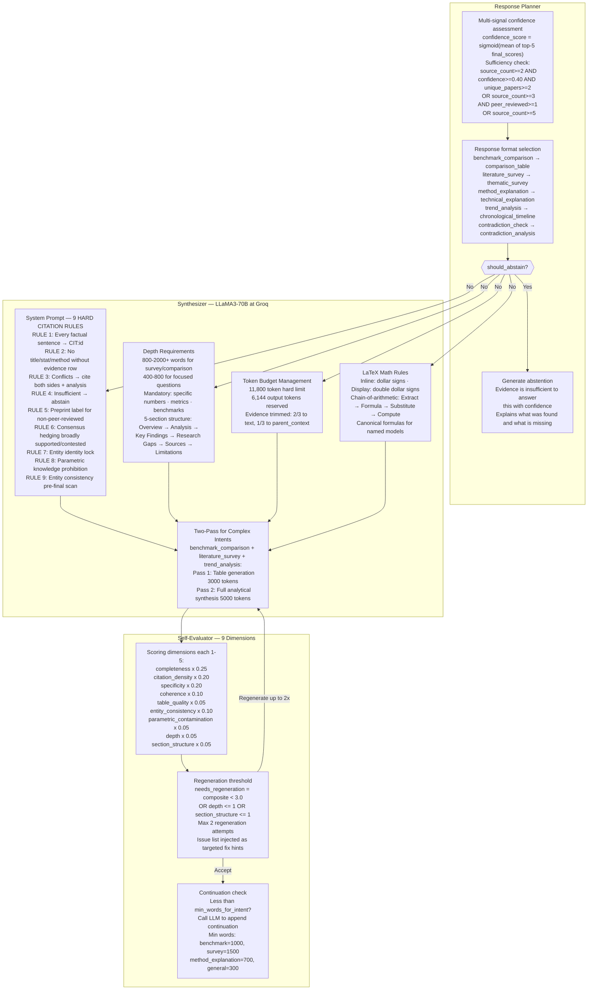

---

## ✦ Verification & Quality System

```mermaid
flowchart LR
    RAW["Raw synthesized\nMarkdown text\nwith CIT:id tags"]

    subgraph CITATION_VERIFY["Citation Verification"]
        CV1["Extract all CIT:id patterns\nvia regex"]
        CV2["Validate each evidence_id\nexists in evidence table\nHallucinated? → flag warning"]
        CV3["NLI Entailment Check\ncross-encoder/nli-deberta-v3-base\nThreshold: 0.55\nLow score → claim not fully supported"]
        CV4["Retraction Check\nis_retracted=True → add RETRACTED warning"]
        CV5["Preprint Label\nis_preprint=True → Preprint label\nis_peer_reviewed=False → note in Sources"]
        CV6["Replace CIT:id with N\nBuild citation number map\ncitation_number · evidence_id · is_valid · nli_score"]
    end

    subgraph RENDER["Citation Renderer"]
        CR1["Citation Cards\nFor each numbered reference:\n  title · authors · year · venue\n  source_url · is_peer_reviewed"]
        CR2["Source URL Builder\narXiv → arxiv.org/abs/id\nOpenReview → openreview.net/forum\nACL → aclanthology.org/id\nDOI → doi.org/doi"]
    end

    subgraph MISSING_SECTIONS["Required Section Validator"]
        MS1["Check for mandatory sections:\nSources · Limitations and Confidence\nResearch Gaps for survey/comparison"]
        MS2["Missing? → Groq generates and appends\nStreams appended section as synthesis_token\nEmits quality_warning SSE with missing_sections list"]
    end

    subgraph FINAL_SAVE["Persistence"]
        FS1["SQLite:\n  save_evidence_table\n  save_answer\n  insert_message role=assistant\nFull audit trail preserved"]
    end

    RAW --> CV1 --> CV2 --> CV3 --> CV4 --> CV5 --> CV6
    CV6 --> CR1 --> CR2
    CV6 --> MS1
    MS1 -->|"missing"| MS2
    CR2 --> FS1
    MS2 --> FS1
    FS1 --> DONE(["answer_complete SSE\nmarkdown_text\ncitation_cards\nuncertainty_flags\nquality_meta"])
```

---

## ✦ External Integrations

```mermaid
flowchart TD
    subgraph EXA_DETAIL["Exa Neural Search — Primary §7.4.1"]
        EX1["Search type: auto — neural + keyword hybrid\nAutoprompt enabled: AI-enhanced query\nHighlights: 5 sentences x 3 per URL\nLivecrawl timeout: 8000ms\nMax characters: 20,000 per result"]
        EX2["Year filtering pushed to Exa API\nnum_results: 8 configurable\nDomain: academic sources prioritized"]
        EX3["Paper extraction:\nTitle · URL · year · author · abstract\nHighlight passages → chunks → BM25/dense"]
        EX4["Fallback gate:\n≥ 2 Exa results → skip Tavily\n< 2 results → activate Tavily fallback"]
    end

    subgraph TAVILY_DETAIL["Tavily Web Search — Fallback §7.4.2"]
        T1["search_depth: advanced\nmax_results: 8\ntopic: general or news for trend_analysis\nHTTP timeout: 60s"]
        T2["Domain filter: arxiv.org · openreview.net\naclanthology.org · proceedings.mlr.press\nnature.com · pubmed.ncbi.nlm.nih.gov\nbiorxiv.org · semanticscholar.org"]
        T3["Recency ranking:\nYears extracted from content signals\nRecent papers boosted in scoring"]
        T4["Strict fallback:\nOnly activated when Exa returns < 2 results\nNot a parallel search — sequential fallback only"]
    end

    subgraph S2_DETAIL["Semantic Scholar — Supplement"]
        S1["Concurrent arXiv queries\nDOI lookup · title search\nField of study classification"]
        S2["Rich metadata:\ncitation_count · influential_citation_count\nfields_of_study · is_open_access\nvenue · journal · conference"]
        S3["Peer review inference:\nVenue name → is_peer_reviewed classification\narXiv-only → is_preprint=True"]
        S4["Runs concurrently with Exa+Tavily\nAdds papers to corpus regardless of Exa results\nS2_AUTO_FETCH=True by default"]
    end

    EX1 --> EX2 --> EX3 --> EX4
    T1 --> T2 --> T3 --> T4
    S1 --> S2 --> S3 --> S4
```

---

## ✦ Streaming SSE Contract

NexusScholar communicates with the frontend via **Server-Sent Events**. Every event type is guaranteed — the frontend must not depend on event ordering beyond the defined sequence.

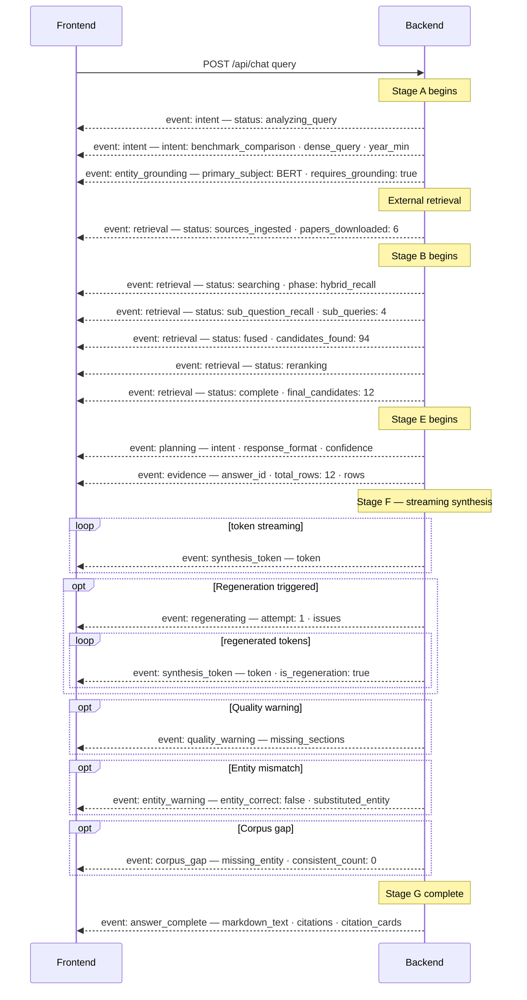

### Complete SSE Event Reference

| Event | Key Payload Fields | When Emitted |
|-------|-------------------|--------------|
| `intent` | `status`, `intent`, `dense_query`, `year_min`, `year_max` | Start + after classification |
| `entity_grounding` | `primary_subject`, `entity_type`, `exclusion_count`, `requires_grounding` | When specific entity detected |
| `retrieval` | `status`, `phase`, `candidates_found`, `final_candidates`, `papers_downloaded` | Multiple times through retrieval |
| `planning` | `intent`, `response_format`, `confidence`, `is_sufficient` | After planner |
| `evidence` | `answer_id`, `total_rows`, `confidence`, `rows[]` | Before synthesis |
| `synthesis_token` | `token`, `is_regeneration` | Streaming synthesis |
| `regenerating` | `attempt`, `issues`, `previous_score` | If quality insufficient |
| `quality_warning` | `missing_sections` | If required sections absent |
| `entity_warning` | `entity_correct`, `substituted_entity`, `confidence` | If entity mismatch post-synthesis |
| `corpus_gap` | `missing_entity`, `consistent_count`, `total_count` | If entity not in corpus |
| `answer_complete` | `markdown_text`, `citations`, `citation_cards`, `quality_meta`, `uncertainty_flags` | Pipeline complete |
| `error` | `message`, `suggestion` | On pipeline error |

---

## ✦ Evaluation Harness

NexusScholar includes a rigorous evaluation system to measure retrieval and generation quality, and to catch regressions before they reach production.

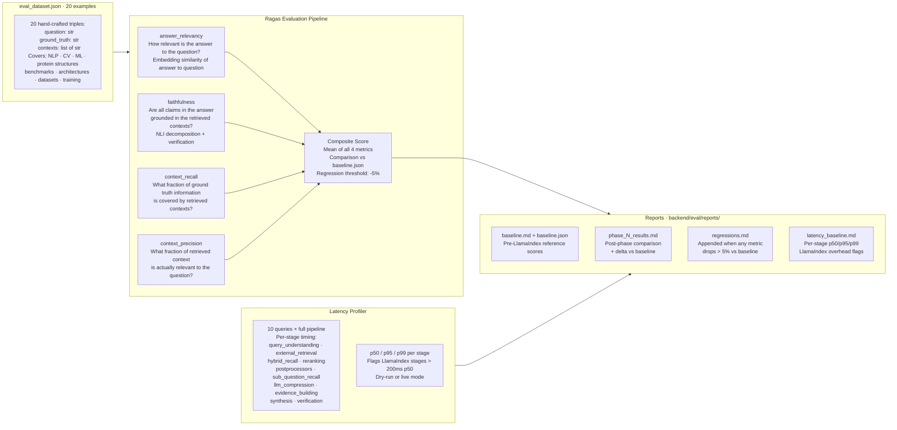

### Running the Evaluation

```bash
# Install eval dependencies
pip install ragas>=0.1.0 datasets>=2.14.0

# Generate baseline (run BEFORE any changes)
python -m backend.eval.ragas_eval --report-name baseline

# After each phase, compare to baseline
python -m backend.eval.ragas_eval --report-name phase_2_results --check-regression

# Latency profile (dry-run — no API calls)
python -m backend.eval.latency_profile --queries 10

# Latency profile (live — requires running backend + API keys)
python -m backend.eval.latency_profile --live --queries 10 --report-name phase_2_latency
```

### Regression Policy

| Condition | Action |
|-----------|--------|
| Any metric drops ≤ 5% | Accept — normal variance |
| Any metric drops > 5% | Revert phase, document in `regressions.md` |
| `faithfulness` drops any amount | Investigate immediately — citation trust at risk |
| `context_precision` drops > 3% | Review postprocessor cutoff thresholds |

---

## ✦ Configuration Reference

All settings are loaded from environment variables (`.env` file or shell). The `Settings` dataclass in `config.py` provides typed defaults for every field.

### Core Model Settings

| Variable | Default | Description |
|----------|---------|-------------|
| `GROQ_API_KEY` | — | Groq API key (required) |
| `GROQ_MODEL_PRIMARY` | `llama3-70b-8192` | Main synthesis + reranking model |
| `GROQ_MODEL_FAST` | `llama-3.1-8b-instant` | Intent classification, compression, extraction |
| `EMBEDDING_MODEL` | `BAAI/bge-large-en-v1.5` | Dense retrieval embeddings |
| `RERANKER_MODEL` | `BAAI/bge-reranker-v2-m3` | Cross-encoder reranker |
| `NLI_MODEL` | `cross-encoder/nli-deberta-v3-base` | Citation entailment verification |

### Retrieval Tuning

| Variable | Default | Description |
|----------|---------|-------------|
| `BM25_TOP_K` | `120` | Candidates per BM25 query |
| `DENSE_TOP_K` | `120` | Candidates per dense query |
| `FUSED_TOP_K` | `80` | Candidates after RRF fusion |
| `RRF_K` | `60` | RRF smoothing constant |
| `RERANKED_TOP_K` | `30` | Candidates after cross-encoder |
| `FINAL_EVIDENCE_TOP_K` | `18` | Final evidence set size |
| `GRAPH_EXPANSION_LIMIT` | `15` | Max citation graph expansion |
| `PASSAGE_CHUNK_TOKENS` | `384` | Sliding window size (tokens) |
| `PASSAGE_STRIDE_TOKENS` | `192` | Sliding window stride (50% overlap) |

### Entity Grounding

| Variable | Default | Description |
|----------|---------|-------------|
| `ENTITY_EXTRACTION_ENABLED` | `True` | Enable entity profile extraction |
| `ENTITY_GROUNDING_PENALTY` | `0.50` | Score penalty for wrong-entity chunks |
| `ENTITY_GROUNDING_BOOST` | `0.12` | Score boost for matching-entity chunks |
| `ENTITY_SPECIFICITY_THRESHOLD` | `0.60` | Min specificity to activate grounding |
| `MIN_ENTITY_CONSISTENT_CANDIDATES` | `2` | Min consistent candidates before corpus_gap abstention |
| `CORPUS_GAP_ABSTENTION_ENABLED` | `True` | Enable corpus gap detection |
| `ENTITY_VERIFY_POST_SYNTHESIS` | `True` | Post-synthesis entity consistency check |
| `ENTITY_VERIFY_CONFIDENCE_THRESHOLD` | `0.70` | Min confidence to prepend entity warning |

### LlamaIndex Feature Flags

| Variable | Default | Description |
|----------|---------|-------------|
| `LLAMAINDEX_POSTPROCESSORS_ENABLED` | `True` | SentenceEmbeddingOptimizer + LongContextReorder + MetadataReplacement |
| `QUERY_ROUTING_ENABLED` | `True` | Intent-aware retrieval config routing |
| `STRUCTURED_CLAIMS_ENABLED` | `True` | Pre-synthesis structured claim extraction |
| `SUB_QUESTION_ENABLED` | `True` | Multi-entity query decomposition |
| `SEMANTIC_SPLITTING_ENABLED` | `False` | SemanticSplitter for passage chunks (new docs only) |

### External Search

| Variable | Default | Description |
|----------|---------|-------------|
| `EXA_API_KEY` | — | Exa Search API key |
| `EXA_AUTO_FETCH` | `True` | Enable Exa primary search |
| `EXA_NUM_RESULTS` | `8` | Results per Exa query |
| `TAVILY_API_KEY` | — | Tavily API key |
| `TAVILY_AUTO_FETCH` | `True` | Enable Tavily fallback |
| `S2_API_KEY` | — | Semantic Scholar API key (optional) |
| `S2_AUTO_FETCH` | `True` | Enable S2 supplement |
| `COLBERT_ENABLED` | `False` | Enable ColBERT retrieval lane |

### Quality Thresholds

| Variable | Default | Description |
|----------|---------|-------------|
| `SYNTHESIS_TEMPERATURE` | `0.15` | LLM temperature for synthesis |
| `CONFIDENCE_THRESHOLD` | `0.40` | Min sigmoid score for is_retrieval_sufficient |
| `NLI_ENTAILMENT_THRESHOLD` | `0.55` | Min NLI score to mark citation as supported |

---

## ✦ API Reference

### `POST /api/chat`
Main research query endpoint. Returns `text/event-stream`.

**Request body:**
```json
{
  "query": "Compare BERT and RoBERTa on GLUE benchmark",
  "conversation_id": "abc123",
  "corpus_id": "default",
  "recency_filter": "any",
  "intent_override": null
}
```

| Field | Type | Options | Description |
|-------|------|---------|-------------|
| `query` | `string` | — | Research question (required) |
| `conversation_id` | `string` | — | Session ID (auto-generated if omitted) |
| `recency_filter` | `string` | `any` `1y` `3y` | Force recency constraint |
| `intent_override` | `string` | any intent type | Skip intent classification |

**Response:** `text/event-stream` — see [SSE Contract](#-streaming-sse-contract).

---

### `POST /api/ingest/pdf`
Upload a PDF for corpus ingestion.

**Request:** `multipart/form-data` with `file` field.

**Response:**
```json
{
  "paper_id": "sha256_prefix",
  "title": "Attention Is All You Need",
  "chunks_created": 147,
  "status": "indexed"
}
```

---

### `POST /api/ingest/text`
Ingest a text document directly.

```json
{
  "title": "Paper title",
  "text": "Full paper text...",
  "year": 2023,
  "authors": "Vaswani et al.",
  "venue": "NeurIPS"
}
```

---

### Other Endpoints

| Method | Path | Description |
|--------|------|-------------|
| `GET` | `/api/papers` | List all corpus papers |
| `GET` | `/api/papers/{id}` | Paper metadata + chunk count |
| `PATCH` | `/api/papers/{id}/year` | Manually repair year metadata |
| `GET` | `/api/audit/missing-years` | List papers without year metadata |
| `GET` | `/api/health/pipeline` | Index sizes, model load, cache stats |
| `GET` | `/health` | Basic health check |
| `POST` | `/api/ingest/rebuild` | Rebuild BM25 + dense indexes from scratch |

---

## ✦ Quick Start

### Prerequisites

```bash
# Python 3.11+
python --version

# Clone
git clone https://github.com/your-org/nexusscholar
cd nexusscholar
```

### 1. Environment Setup

```bash
# Create and activate virtual environment
python -m venv backend/venv
source backend/venv/bin/activate       # Linux/Mac
# backend\venv\Scripts\activate        # Windows

# Install core dependencies
pip install -r backend/requirements.txt

# Install LlamaIndex (enables accuracy enhancements)
pip install llama-index-core>=0.10.0

# Install eval suite
pip install ragas>=0.1.0 datasets>=2.14.0
```

### 2. Configure API Keys

```bash
# backend/.env
GROQ_API_KEY=gsk_...       # Required
EXA_API_KEY=...            # Recommended (primary search)
TAVILY_API_KEY=...         # Recommended (fallback search)
S2_API_KEY=...             # Optional (metadata enrichment)
```

### 3. Start the Backend

```bash
cd backend
python -m uvicorn main:app --host 0.0.0.0 --port 8000 --reload
```

On first start, NexusScholar will:
1. Initialize the SQLite database and embedding cache
2. Build BM25 and dense indexes (empty corpus on first run)
3. Compute PageRank on the citation graph
4. Log any papers missing year metadata as warnings

### 4. Ingest Papers

```bash
# Via API
curl -X POST http://localhost:8000/api/ingest/pdf \
  -F "file=@attention_is_all_you_need.pdf"

# Check corpus size
curl http://localhost:8000/api/papers | jq '.total'
```

### 5. Ask a Research Question

```bash
curl -N -X POST http://localhost:8000/api/chat \
  -H "Content-Type: application/json" \
  -d '{"query": "How does multi-head attention work?"}' \
  --no-buffer
```

### 6. Run Evaluation

```bash
# Baseline (before changes)
python -m backend.eval.ragas_eval --report-name baseline

# Latency profile
python -m backend.eval.latency_profile

# After changes, check for regressions
python -m backend.eval.ragas_eval --report-name phase_2_results --check-regression
```

---

## ✦ Performance Characteristics

| Stage | p50 | p95 | Notes |
|-------|-----|-----|-------|
| Query understanding | 180ms | 320ms | 2× Groq fast-model calls (concurrent) |
| External retrieval | 1,200ms | 2,800ms | Exa + S2 concurrent — network-bound |
| Hybrid recall | 45ms | 120ms | Local BM25 + FAISS — CPU-bound |
| Sub-question recall | 95ms | 240ms | Only for comparison/survey intents |
| Cross-encoder reranking | 280ms | 580ms | sentence-transformers — CPU-bound |
| Listwise reranking | 200ms | 400ms | Groq fast-model call |
| LlamaIndex postprocessors | 85ms | 180ms | SentenceEmbeddingOptimizer is the bottleneck |
| Structured claims extraction | 180ms | 350ms | Groq fast-model call |
| Evidence building | 25ms | 60ms | Local computation |
| Synthesis — first token | ~600ms | ~1,200ms | Groq streaming TTFT |
| Synthesis — full response | ~2,800ms | ~5,000ms | 800–2,000 word response |
| Verification | 240ms | 480ms | NLI model + self-evaluator |
| **Total — typical query** | **~5–8s** | **~12s** | First token ~3s, full response ~8s |

### Scaling Notes

- **CPU-only**: Fully functional. FAISS uses flat index for < 10,000 chunks; IVF for larger corpora.
- **Memory**: ~2 GB base RAM. BAAI/bge-large uses ~1.4 GB, reranker uses ~400 MB.
- **Concurrency**: FastAPI async + aiosqlite WAL enable concurrent requests without blocking.
- **Embedding cache**: Persistent SQLite vectors. Restarts re-use cached embeddings — index rebuilds are fast.
- **ColBERT**: Optional 4th retrieval lane. Must be pre-built before enabling (`COLBERT_ENABLED=False` default).

---

## ✦ Directory Structure

```
nexusscholar/
│
├── backend/
│   ├── main.py                          # FastAPI entrypoint, lifespan, global singletons
│   ├── config.py                        # Settings dataclass, all env vars, startup validation
│   ├── requirements.txt
│   │
│   ├── api/routes/
│   │   ├── chat.py                      # ★ Main SSE pipeline orchestrator (700+ lines)
│   │   ├── ingest.py                    # PDF/text ingestion endpoints
│   │   ├── papers.py                    # Corpus management + audit endpoints
│   │   └── evidence.py                  # Evidence explorer endpoints
│   │
│   ├── ingestion/
│   │   ├── pdf_parser.py               # Grobid → Marker → PyMuPDF (3-tier fallback)
│   │   ├── chunker.py                  # 5-level multi-granular chunker
│   │   ├── document_pipeline.py        # ★ LlamaIndex SemanticSplitter + SentenceWindow
│   │   ├── claim_extractor.py          # Sentence-level claim extraction
│   │   ├── table_extractor.py          # Markdown table → key:value serialization
│   │   ├── normalizer.py               # Metadata normalization (year/venue/DOI)
│   │   ├── graph_builder.py            # Citation graph construction + PageRank
│   │   └── service.py                  # Ingestion orchestration
│   │
│   ├── indexing/
│   │   ├── bm25_index.py               # rank-bm25 + compound tokens + Snowball stemming
│   │   ├── dense_index.py              # BAAI/bge-large + FAISS + async batch embedding
│   │   ├── colbert_index.py            # ColBERT late-interaction (optional)
│   │   ├── embedding_cache.py          # Persistent SQLite embedding cache
│   │   └── metadata_store.py           # aiosqlite metadata + evidence store
│   │
│   ├── retrieval/
│   │   ├── query_classifier.py         # 10-intent Groq classifier
│   │   ├── query_rewriter.py           # 5-form parallel rewriter + HyDE generation
│   │   ├── entity_extractor.py         # QueryEntityProfile + exclusion entity extraction
│   │   ├── hybrid_recall.py            # BM25+Dense+HyDE+ColBERT → RRF → MMR
│   │   ├── query_router.py             # ★ RetrievalConfig per intent + section boost
│   │   ├── sub_question_engine.py      # ★ Multi-entity query decomposition + merge
│   │   ├── postprocessors.py           # ★ LlamaIndex postprocessor chain
│   │   ├── reranker.py                 # Cross-encoder + multi-signal scoring + listwise
│   │   ├── graph_expander.py           # Citation graph expansion (cited-by + co-citation)
│   │   ├── chunk_expander.py           # Parent-child + sibling passage expansion
│   │   ├── compressor.py               # Entity-aware Groq contextual compression
│   │   └── pseudo_relevance_feedback.py # PRF term expansion
│   │
│   ├── generation/
│   │   ├── groq_client.py              # Groq API client (retry, rate-limit, streaming)
│   │   ├── synthesizer.py              # LLaMA3-70B + 9 hard citation rules + two-pass
│   │   ├── evidence_schema.py          # ★ Structured claim extraction (Pydantic models)
│   │   ├── evidence_builder.py         # EvidenceTable + EvidenceRow construction
│   │   ├── evidence_dedup.py           # Near-duplicate evidence row removal
│   │   ├── planner.py                  # Response format + confidence + abstention logic
│   │   ├── verifier.py                 # Citation tag validation + NLI entailment
│   │   ├── entity_verifier.py          # Post-synthesis entity consistency check
│   │   ├── self_evaluator.py           # 9-dimension quality scoring + regeneration trigger
│   │   └── markdown_fixer.py           # Required-section validator + LLM appender
│   │
│   ├── integrations/
│   │   ├── exa_client.py               # Exa neural search (primary external source)
│   │   ├── tavily_client.py            # Tavily web search (strict fallback)
│   │   ├── semantic_scholar.py         # S2 citation metadata + peer-review inference
│   │   ├── arxiv_client.py             # arXiv direct fetch
│   │   └── source_urls.py              # Canonical academic URL builder
│   │
│   ├── citation/
│   │   ├── resolver.py                 # CIT:id tag → evidence row mapping
│   │   └── renderer.py                 # Citation cards with full metadata
│   │
│   └── eval/
│       ├── ragas_eval.py               # ★ Ragas evaluation harness (4 metrics)
│       ├── latency_profile.py          # ★ Per-stage p50/p95/p99 profiler
│       ├── eval_dataset.json           # 20 hand-crafted evaluation triples
│       └── reports/
│           ├── baseline.md             # Pre-integration baseline scores
│           ├── phase_N_results.md      # Per-phase eval comparison
│           ├── regressions.md          # Regression audit log
│           └── latency_baseline.md     # Stage-level latency baseline
│
└── frontend/
    ├── src/
    │   ├── components/
    │   │   ├── MessageBubble.tsx       # Markdown + citation rendering + copy button
    │   │   ├── EntityWarningBanner.tsx # Entity mismatch danger banner
    │   │   └── QualityBadge.tsx        # Quality score popover with per-dimension chart
    │   └── stores/
    │       └── chatStore.ts            # SSE event consumer + application state
    └── dist/                           # Built frontend (served as static files by FastAPI)
```

> **★** marks files added or significantly enhanced in the LlamaIndex integration phase.

---

<div align="center">

---

```
━━━━━━━━━━━━━━━━━━━━━━━━━━━━━━━━━━━━━━━━━━━━━━━━━━━━━━━━━━━━━━━━━━━━━━━━━━━━━
  Every claim traced to evidence.   Every entity verified.   Every answer earned.
━━━━━━━━━━━━━━━━━━━━━━━━━━━━━━━━━━━━━━━━━━━━━━━━━━━━━━━━━━━━━━━━━━━━━━━━━━━━━
```

**Built with ❤️ by AAYUSH for researchers who demand precision, not plausibility**

*NexusScholar · Enterprise Research Intelligence · v1.0.0*

</div>
